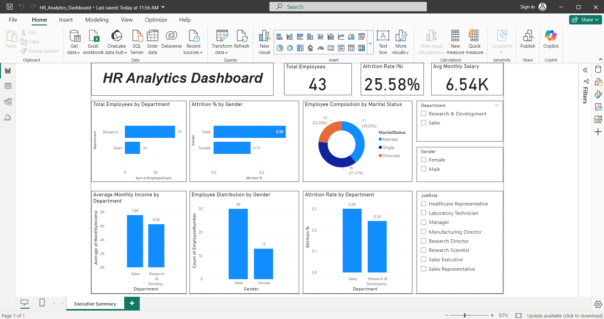

**Employee Performance & Attrition Analysis Using SQL & Power BI**

## Project Overview
This project focuses on analyzing **employee performance and attrition trends** using **SQL for data cleaning & analysis** and **Power BI for interactive dashboard visualization**.

The objective is to help HR teams:
* Understand workforce composition
* Identify attrition patterns by department and gender
* Analyze salary distribution
* Support data-driven HR decision-making


## Tools & Technologies Used
* **SQL** – Data cleaning, transformation, and analysis
* **Power BI** – Interactive dashboard and data visualization
* **CSV Dataset** – HR employee records
* **GitHub** – Version control and project hosting


## Project Structure

employee-attrition-analysis/
├── powerbi/
│   └── HR_Analytics_Dashboard.pbix
├── screenshots/
│   └── dashboard_overview.png
├── data/
│   ├── raw/
│   │   └── WA_Fn-UseC_-HR-Employee-Attrition.csv
│   └── cleaned/
│       └── employees.csv
├── sql/
│   ├── data_cleaning.sql
│   └── analysis_queries.sql
└── README.md

## Dataset Description

* **Source:** IBM HR Analytics Employee Attrition Dataset
* **Records:** 43 employees (after filtering & cleaning)
* **Key Columns:**

  * Age
  * Gender
  * Department
  * Job Role
  * Monthly Income
  * Years at Company
  * Attrition
  * Marital Status

## Data Cleaning (SQL)
Data cleaning was performed using SQL to:
* Remove unnecessary columns
* Standardize categorical values
* Handle null values
* Create analysis-ready tables

SQL file:
sql/data_cleaning.sql


## Data Analysis (SQL)
Key analytical queries include:
* Attrition rate calculation
* Department-wise employee count
* Gender-based attrition analysis
* Average monthly income by department

SQL file:
sql/analysis_queries.sql

## Power BI Dashboard
An interactive HR Analytics dashboard was built using Power BI.

### Key KPIs:
* **Total Employees**
* **Attrition Rate (%)**
* **Average Monthly Salary**

### Visualizations:
* Total employees by department
* Attrition % by gender
* Attrition rate by department
* Employee distribution by gender
* Salary comparison across departments
* Employee composition by marital status

Power BI File:
powerbi/HR_Analytics_Dashboard.pbix

📸 Dashboard Preview:


## Key Insights
* Sales department shows **higher attrition rate** compared to R&D
* Male employees have a **higher attrition percentage**
* Sales employees earn a **higher average monthly income**
* Majority of employees are **married**, followed by single


## How to Run This Project
1. Clone the repository

   ```bash
   git clone https://github.com/your-username/employee-attrition-analysis.git
   ```
2. Review SQL scripts using MySQL / PostgreSQL
3. Open `HR_Analytics_Dashboard.pbix` in **Power BI Desktop**
4. Load the cleaned dataset if prompted

## Use Case
This project demonstrates:
* End-to-end data analytics workflow
* Real-world HR analytics use case
* SQL + Power BI integration

Suitable for:
* Data Analyst Internships
* Business Intelligence Roles
* Analytics Portfolio Projects

## Author
**Shreya Dhameja**
Aspiring Data Analyst
Skills: SQL | Power BI | Python | Excel

* ✅ **Resume bullet points**
* ✅ **LinkedIn project description**
* ✅ **Interview explanation (how to explain this project)**

Just tell me 💙
